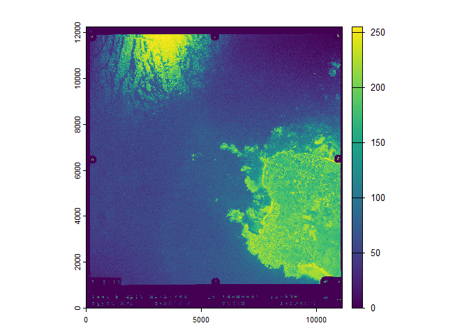

# delorean 

<!-- badges: start -->

[](https://github.com/paul-carteron/delorean/actions/workflows/R-CMD-check.yaml)
[](https://CRAN.R-project.org/package=delorean)
[](https://lifecycle.r-lib.org/articles/stages.html#experimental)
<!-- badges: end -->

The goal of `delorean` is to make it easy to explore, download and
georeference french historical aerial photo from [Remonter le temps -
IGN](https://remonterletemps.ign.fr/).

## Installation

You can install the development version of `delorean` like so:

``` r
devtools::install_github("paul-carteron/delorean")
```

## Usage

``` r
library(delorean)
library(sf)
#> Linking to GEOS 3.13.1, GDAL 3.11.0, PROJ 9.6.0; sf_use_s2() is TRUE
library(terra)
#> terra 1.8.70
library(happign)
#> Please make sure you have an internet connection.
#> Use happign::get_last_news() to display latest geoservice news.
```

### Explore

`delorean` allows exploration of available aerial photos with
`find_photos()`. It intersects the `bbox` of `x` (area of interest) with
all photo footprints. Additional filters can be applied: `year`,
`color`, and `oblique` (see `?delorean::find_photos`).

``` r
x <- get_apicarto_cadastre("29158")
all_photos <- find_photos(x)

photos_1997 <- find_photos(x, year = 1997)

plot(st_geometry(photos_1997), col = "grey90", border = "grey50", main = "1997 Photo footprints")
plot(st_geometry(x), col = "firebrick", add = TRUE)
```


### Download

For downloading, use `get_photos()` with the source returned by
`find_photos()`. By default, the mode is set to `raw`, meaning the image
has no spatial reference.

``` r
# Using photo numero = 430 for the sake of example
photo_1997 <- photos_1997[photos_1997$numero == 430, ]
url <- photo_1997$url

filepath <- get_photos(url, outdir = tempdir())
#> Downloading [1/1] 0...10...20...30...40...50...60...70...80...90...100 - done.
photo <- rast(filepath)
#> Warning: [rast] unknown extent

plot(photo)
```



### Georeference

Historical photos from IGN are provided with a centroid, resolution, and
orientation. From these, a default georeferencing can be performed — but
be aware it is **significantly inaccurate** ! (as shown below).

`get_photos()` offers two other modes: `gcp` and `warp`. The `gcp` mode
only attaches Ground Control Points (GCPs), so the photo is
georeferenced but not resampled onto a regular grid. The `warp` mode
takes longer but resamples the photo to a grid, ensuring compatibility
with most GIS software.

``` r
filepath <- get_photos(url, outdir = "C:\\Users\\PaulCarteron\\Desktop\\temp\\dolorean", mode = "warp")
#> 
#> 
#> Downloading [1/1] 0...10...20...30...40...50...60...70...80...90...100 - done.
#> Warping [1/1]
#> Warning in .warp(src_datasets, dst_filename, list(), t_srs, cl_arg, quiet): GDAL FAILURE 1: Deleting C:\Users\PaulCarteron\Desktop\temp\dolorean/IGNF_PVA_1-0__1997-04-10__CA97S00621_1997_F0517-0520_0430.tif failed:
#> Permission denied
#> 0...10...20...30...40...50...60...70...80...90...100 - done.
photo <- rast(filepath)

plot(photo)
plot(project(vect(x), crs(photo)), border = "red", lwd = 2, add = T)
```


### Georeference Help

Because the default georeferencing remains **significantly inaccurate**,
`delorean` provides helpers to support manual georeferencing through the
function `get_georef_helpers()`. This wrapper around
`happign::get_wfs()` downloads prominent features that can assist in
georeferencing, such as hydrological elements, infrastructure, roads,
and buildings. All these layers are retrieved from IGN’s [BD TOPO®
V3](https://geoservices.ign.fr/bdtopo) dataset.

``` r
georef_helpers <- get_georef_helpers(x, "infra", "other")
#> Features downloaded : 81
#> Features downloaded : 32
#> Warning: No data found, NULL is returned.
#> Features downloaded : 19

plot(project(vect(x), crs(photo)), col = "grey90", border = "grey50", main = "Georef helpers on Penmarc'h")
plot(vect(georef_helpers$construction_lineaire), lwd = 2, col = "forestgreen", add = TRUE)
plot(vect(georef_helpers$construction_ponctuelle), col = "firebrick", add = TRUE)
plot(vect(georef_helpers$point_de_repere), col = "royalblue", add = TRUE)
```


